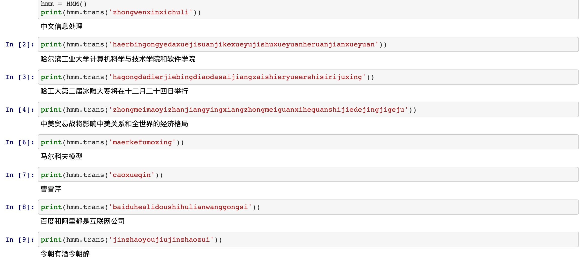

## 基于Bigram+HMM的拼音汉字转换

测试见[files/trans_test.ipynb](files/trans_test.ipynb)

### corpus
包括训练集和测试集语料文件  
peopelnews2018.txt 人民日报2018语料库（爬虫爬取）  
sougouwords.txt 搜狗词库语料库  
测试集语料包括人民日报、搜狗语料、微博语料三类：  
*_test.txt 拼音文件，测试输入  
*_gold.txt 正确结果文件  
*_pred.txt 汉字转换结果文件  

### files
结果分析相关图表

### model_params
模型参数文件（根据语料库训练得到）  
bidic.json 拼音二元词表，拼音之间的的转换概率表  
emiss_prob.json 汉字-拼音发射概率矩阵  
init_prob.json 初始概率矩阵  
pinyin.json 拼音表，用于构建trie树  
pinyin_states.json 多音字表  
trans_prob.json 汉字间转移概率矩阵  

### .py代码文件 
包括语料库爬虫、模型参数计算、模型实现以及结果可视化分析等代码实现  

#### crawl.py
人民日报2018语料库爬虫实现代码  

#### trie.py
trie树实现代码，用于实现拼音的存储数据结构  

#### count_for_bigram.py
bigram参数计算实现代码  

#### count_for_hmm.py
hmm参数计算实现代码  

#### bigram.py
bigram模型实现代码  

#### hmm.py
hmm模型实现代码  
注释68-69行进行输入测试  

#### predict.py
实现测试集语料拼音汉字转换代码

#### deal.py
语料库处理以及结果分析可视化代码实现  

### 所做工作
Step1. 爬取人民日报2018全年新闻作为长句语料库，提取各领域搜狗词库词作为短词语语料库；  
Step2. 调用pypinyin库对数据集进行拼音标注；  
Step3. 计算Bigram所需参数，包括拼音表，拼音间转移概率；  
Step4. Trie保存拼音表，对输入拼音串构建全有向切分图；  
Step5. Viterbi算法搜索全有向切分图获得最优拼音组合；  
Step6. 计算HMM所需参数，包括初始概率、发射概率、转移概率；  
Step7. Viterbi算法在最优拼音组合上计算最优汉字序列。  

